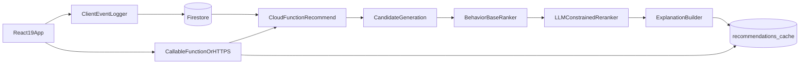

# Firebase Recommendation Engine MVP Plan

## Goal

Ship an explainable, behavior-based recommendation engine in a few hours that suggests "next songs" using:

- Playlist co-occurrence
- Search behavior overlap
- Play/skip signals
- Recent listening history

No mood features in v1 (but schema remains extensible).
LLM is included in the core suggestion path as a constrained re-ranking stage.

## Recommended Architecture (Fast + Credible)

## Data Model (Firestore Collections)

Use flat documents optimized for quick querying and simple cloud-function logic.

- `songs/{songId}`
  - `title`, `artist`, `genreTags[]`, `tempoBucket`, `popularity`
- `users/{userId}`
  - `createdAt`, `displayName`
- `playlists/{playlistId}`
  - `userId`, `name`, `songIds[]`, `createdAt`
- `events/{eventId}`
  - `userId`, `songId`, `eventType` (`play` | `skip` | `search` | `add_to_playlist`)
  - `queryText` (for search only), `playlistId` (optional), `ts`
- `song_stats/{songId}` (pre-aggregated for speed)
  - `playCount`, `skipCount`, `addToPlaylistCount`, `searchHitCount`, `updatedAt`
- `cooccurrence_playlist/{songId}`
  - `neighbors: { [otherSongId]: score }`
- `cooccurrence_search/{songId}`
  - `neighbors: { [otherSongId]: score }`
- `recommendations_cache/{userId}`
  - `generatedAt`, `items: [{ songId, score, reasons[] }]`

## Recommendation Strategy (v1)

Implement a two-stage hybrid ranker:

- Stage A deterministic retrieval and base scoring
- Stage B LLM constrained re-ranking over top candidates

### 1) Candidate Generation

Given current context (current playlist songs + recent searches + recent listens):

- Pull top neighbors from `cooccurrence_playlist`
- Pull top neighbors from `cooccurrence_search`
- Add globally trending songs in matching genres as fallback
- Remove songs already in current playlist and recently skipped

### 2) Base Scoring Formula (Deterministic)

Compute weighted score per candidate:

- `0.40 * playlistSimilarity`
- `0.25 * searchSimilarity`
- `0.20 * globalEngagement` (high play/add, low skip)
- `0.15 * recencyAffinity` (based on recent listens)

Penalty:

- subtract if user recently skipped candidate or same artist repeatedly

Normalize each component to `[0,1]` before weighting.

### 3) LLM-Constrained Re-Ranking (Core Path)

Run LLM on only top 20-30 deterministic candidates. The model cannot invent songs.

Input payload:

- User context summary (recent searches, recent plays/skips, active playlist signals)
- Candidate list with IDs + metadata + base score + feature contributions
- Strict instruction: output same candidate IDs only, with optional score adjustment in bounded range

Output contract:

- `[{ songId, llmDelta, reasonText, confidence }]`
- Enforce `llmDelta` bounds (example: `-0.08` to `+0.08`) in server-side validator
- Final score: `baseScore + llmDelta`

Guardrails:

- If parse/validation fails or timeout occurs, fall back to deterministic base ranking
- Log prompt version and model output for auditability

### 4) Explainability Output

For each recommendation, produce 1-3 reasons from dominant signals plus LLM rationale, e.g.:

- "Listeners who added songs in your playlist also added this track"
- "Matches your recent searches for lo-fi and chill beats"
- "High completion and low skip rate among similar listeners"
- "Given your recent shift toward upbeat tracks, this is likely a better next pick"

## Synthetic Data Bootstrapping (Critical for No-Data Start)

Generate realistic seed behavior before demo using Spotify Web API as the source of truth.

### Source-of-Truth Rules (Mandatory)

- Fetch track metadata from Spotify Web API (client credentials flow), market = `US`.
- Cache raw Spotify responses and a normalized catalog locally for reproducible runs.
- Do not invent song names, artists, album IDs, or Spotify IDs.
- Every seeded track must map to a real cached Spotify API record.
- Fail the seed run if any generated track/event references an unknown track ID.

### Seed Scale (quick but convincing)

- ~300 songs (from cached US Spotify catalog)
- ~200 synthetic users
- ~3,000 events
- ~400 playlists

### Generation Rules

- Build user personas from real Spotify metadata (genre/artist/tempo proxies)
- Simulate session flows:
  - search -> play sequence -> add to playlist -> occasional skip
- Introduce noise (10-20%) so recommendations are not trivially perfect
- Keep transitions correlated to real-track similarity (shared artist/genre/popularity)

### Deliverables

- A script to fetch and cache Spotify US catalog snapshots
- A script to validate all seed records against cached Spotify truth data
- A script to seed `songs`, `users`, `playlists`, `events` from pinned cache
- A script to compute and write `song_stats`, `cooccurrence_playlist`, `cooccurrence_search`

## Services to Build (Firebase)

### Cloud Functions

- `ingestEvent(event)`
  - Validates and writes interaction event
- `buildAggregates()`
  - Batch job to refresh `song_stats` and co-occurrence docs
- `getRecommendations(userId, context)`
  - Generates deterministic base ranking
- `rerankWithLLM(userContext, candidates)`
  - Calls model API with strict schema and bounded deltas
- `getRecommendations(userId, context)`
  - Orchestrates base ranking -> LLM re-rank -> explanation + fallback logic

### Client Service Layer

- Event logger service from React app
- Recommendation fetch service with cache-first behavior

## LLM Scope (What Is In vs Out)

LLM is in the **main functionality** for final ordering and rationale quality, but constrained:

- In scope: re-ranking top deterministic candidates and generating human-readable reasons
- Out of scope: open-ended candidate generation from full catalog (too risky/noisy in this timebox)

This gives you credible AI usage while preserving deterministic safety and debuggability.

## MVP Implementation Order (Few-Hours Execution)

1. Set up Firebase project + Firestore collections + basic indexes
2. Add Spotify fetch + local cache pipeline (US market, pinned snapshot version)
3. Add synthetic data generator that reads only cached Spotify catalog
4. Add seed integrity validator (no invented/missing IDs or metadata)
5. Build aggregate/co-occurrence batch function
6. Build deterministic recommendation function (candidates -> base score)
7. Add LLM re-rank function with strict response schema and bounded deltas
8. Add React UI panel: "Because you liked..." with 5 recommendations and reason chips
9. Add one-click "simulate events" button for demo freshness
10. Validate with 3 scripted demo scenarios + one forced LLM-fallback test

## Minimal Validation Checklist

- 100% seeded tracks originate from cached Spotify API responses
- 0 invented song names, artists, album IDs, or Spotify IDs
- Same catalog version + RNG seed reproduces identical seed outputs
- Recommendations exclude songs already in active playlist
- Skip-heavy songs rank lower than play-heavy alternatives
- Changing search term changes top recommendations
- Explanation reasons correspond to actual score components
- Cold-start user gets fallback genre/trending recommendations
- LLM output never introduces unknown song IDs
- If LLM fails, deterministic ranking still returns within latency budget

## Suggested File Structure

Assuming a monorepo with React app + functions:

- `apps/web/src/services/events.ts`
- `apps/web/src/services/recommendations.ts`
- `apps/web/src/components/RecommendationPanel.tsx`
- `functions/src/ingestEvent.ts`
- `functions/src/buildAggregates.ts`
- `functions/src/getRecommendations.ts`
- `functions/src/lib/scoring.ts`
- `functions/src/lib/llmReranker.ts`
- `functions/src/lib/explanations.ts`
- `functions/src/lib/llmSchema.ts`
- `scripts/spotify/fetchSpotifyCatalog.ts`
- `scripts/data/spotify-cache/catalog-us-v1.json`
- `scripts/data/spotify-cache/manifest.json`
- `scripts/lib/spotifyTruthValidator.ts`
- `scripts/lib/behaviorModel.ts`
- `scripts/config/seedConfig.json`
- `scripts/seedSyntheticData.ts`
- `scripts/buildCooccurrence.ts`

## Interview/Take-Home Positioning

Frame your engine as:

- "Hybrid retrieval + ranking + LLM re-ranking"
- "Behavior-driven collaborative filtering signals"
- "Explainable recommendations with deterministic features and model rationale"
- "LLM used safely with bounded influence and deterministic fallback"

That framing sounds production-minded while still being achievable in your timebox.
